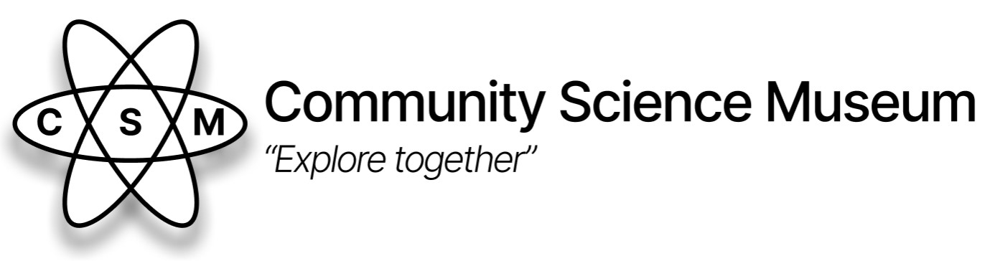

# Square Eyes



Come join us at the Community Science Museum where we’re committed to making science accessible to all. 

## Descriptoin

This is a website for a community science museum.

This website contains theese pages:

- Home
- Explore
- Exhibitions
- Events
- Visit
- Get Involved

## Built With
This site is bulit with:
- HTML
- CSS

## Getting Started

### Installing

To run this project locally, follow these steps:

1. Clone the repository:
    ```bash
    git clone https://github.com/edrivvoll/Semester-Project-1.git
    ```

2. Navigate to the project directory:
    ```bash
    cd Semester-Project-1
    ```

### Running

1. Open the `index.html` file:
    Simply open the `index.html` file in your web browser to view the website.

## Usage

Once you have the project files, you can open the `index.html` file in any web browser to view and interact with the application.


## Contributing

We welcome contributions to the project. To contribute, please follow these steps:

1. Fork the repository.
2. Create a new branch (`git checkout -b feature/your-feature`).
3. Make your changes.
4. Commit your changes (`git commit -m 'Add your feature'`).
5. Push to the branch (`git push origin feature/your-feature`).
6. Open a Pull Request.

## Contact

For any questions or feedback, please contact:

- Email: espen@drivvoll.no
